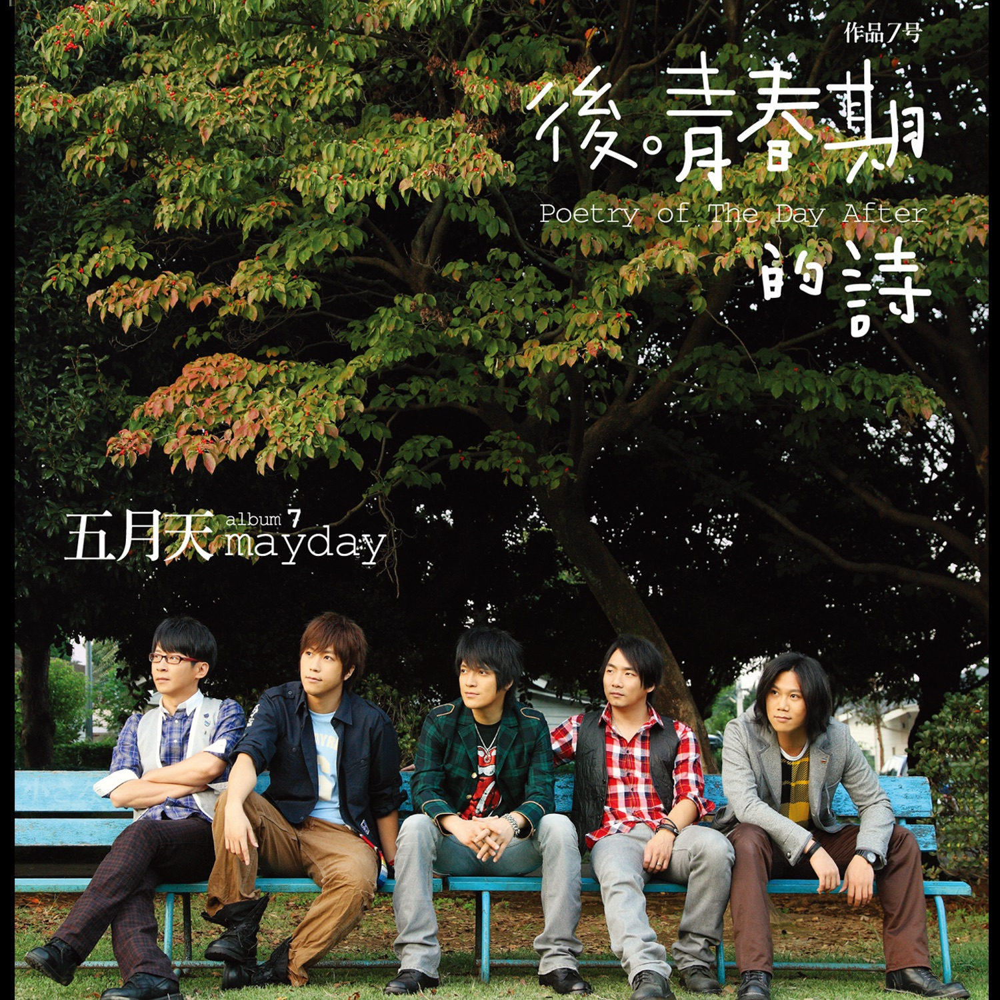

> 在终点之前奔驰的黎明，  
> 高悬的远星也照耀着你。  
> 放声高歌，  
> 张开双臂，  
> 去迎接日出吧。
  
  不知道各位读者在中学时期有没有过这样的感受：每当送毕业生去考场的时候，心情是既兴奋又紧张的，还夹杂着一些迷茫的情绪的。我就一直有这样的感受。

  初一的时候，那时送考的心境很烦躁——那天（2023年6月11日）是周日，打扰了我的休息时间。我的初中学校倒是每年6月11日都要举行盛大的送考活动。边看节目边看初三学长们收拾行囊的时候，我感慨到：初三一整年真的像他们所说的过得那么快吗？初一，初二……到我们中考的时候，他们也快成年了啊！也许，真像班主任所说的‘三年时间，看似很长，实则很短’吧。

  一晃，一年又过去了。初二那年，语文老师让我们随机找初三的学长们为他们写一份毕业祝福。临近中考，我确实写了一份毕业祝福送给一位毕业生。结果那位同学喜出望外。他看我诧异的样子，就说“这是我收到的最好的一份毕业礼物！有了这份祝福和你们一千多双眼睛的目送，我的信心比什么时候都要强！”这时，我懂得，考生们最大的愿望，莫不过于来自学弟学妹们的祝福和目送！

  送行仪式结束后，迷茫的想法涌入心头：他们走后，我就初三了，“三年如一日”，看来是真的。我能在中考考场上超越三年的自我吗？我能上一所心仪的高中吗？

  终于，迎来了属于我的毕业季。6月5日，我收到了一位来自初二同学的祝福。文字虽然质朴，但内容实在真切！读完之后，湿了眼眶！是啊，中考就像接力棒，一届接一届，永不停息！只有一届又一届的学生的祝福，才能让考生们在考场上不觉得空虚！

  一转眼，来到高一下学期。又是一个毕业季！只不过高中学校不会举行送行活动。我仍然提起笔，为一位高三的同学写了一篇毕业祝福。我也希望，他能借我的这篇祝福，考上心仪的大学！我也希望，有更多的同学为他们送行，至少他们不会感到空虚，不觉得自己是孤军奋战！

<blockquote>

在这个六月，我想把五月天的这首《笑忘歌》，轻轻送给每一个正在奔赴考场的你——愿你在合上笔盖的那一刻，有着战士收刀入鞘般的骄傲。

<!-- ===== 音乐播放器卡片（含自动播放） ===== -->

  <!-- 左侧：专辑封面 -->
  

    
  

  <!-- 右侧：歌曲信息 + 播放器 -->
  

    

      🎵 笑忘歌
    

    

      五月天 · 后青春期的诗
    

    <!-- 
      ★★★★★ 音频播放器 ★★★★★
      1. 加了 autoplay 属性，打开页面会尝试自动播放。
      2. 请把下面 src="./笑忘歌.flac" 里的文件名，改成你实际的文件名（比如 歌曲.flac）。
      3. 如果浏览器不支持 FLAC，可以准备一份 MP3 备用，取消下面第二行 source 的注释即可。
    -->
    <audio 
      controls 
      autoplay 
      preload="auto" 
      style="
        width: 100%;
        max-width: 320px;
        height: 42px;
        border-radius: 6px;
        outline: none;
        background: transparent;
      "
    >
      <source src="./五月天 笑忘歌.flac" type="audio/flac">
      <!-- 备用格式（如需 MP3，请取消下面这行的注释，并把文件名改成你的 mp3 文件） -->
      <!-- <source src="./笑忘歌.mp3" type="audio/mpeg"> -->
      抱歉，您的浏览器不支持 HTML5 音频。
    </audio>

    

      “这一生只愿只要平凡快乐，谁说这样不伟大呢。”
    

  

<!-- ===== 播放器结束 ===== -->

</blockquote>

  致——所有奔赴考场的同学，一路顺风！

六月五日。
