> 这件事很长，还请你耐心看完。

## 人物背景

这件事情已经构成类似民事纠纷的程度了。牵扯进来的主要人物有三个人：

- **雷德（化名）**  —— 当事人、受害者
- **小晨（化名）** —— 邻居，当事人、受害者  
- **刘某（化名）** —— 施害人

为方便叙述，我将以时间线的方式梳理整件事。

## 时间线

### 小晨与刘某的初识

2025 年 2 月，刘某与小晨以及小殷（关联不大）一起约去成都青龙湖公园玩。小晨因为身体素质不好，没走一会儿就不想走了。刘某突然主动要求背他——当时他们并不熟。小晨觉得这个人有点奇怪，一开始没答应，但在刘某再三要求下还是同意了。

令人意想不到的是，刘某喊来其他游客**偷偷拍下他背小晨的照片**——并且小晨对此完全不知情。更过分的是，刘某将照片配上恶心的文案，以分组可见的形式发在朋友圈里。正因如此，小晨一直没发现这条朋友圈。

四月初的样子，刘某给小晨寄了一些水果，并且**强制要求小晨收下**。小晨很不情愿地给了一个驿站的地址。后来，刘某经常来成都找小晨玩，还请他吃了一顿火锅。

### 我（雷德）与刘某的交集

2026 年 3 月 28 日，刘某通过 QQ 空间添加我为好友，6:40 通过验证。

加上之后，他跟我聊了很多——历史、星球……一大堆乱七八糟的话题。我当时没有直接删他，只是先留着。7:20 的时候他跟我说去上早自习了，我立刻起了疑：**哪个学校 7:20 才去上早自习？** 这个人让我觉得有点不对劲。

当天 13:31，他问我是不是高一的，还声称自己是二一年上的高一**。后来他才说是**文转理**的**高三复读生。

晚上，他开始追问我的名字。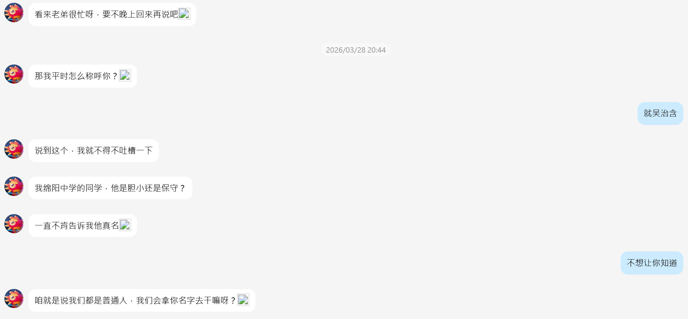我有点困惑：一个人告不告诉你真名，又怎样呢？后来我去上学了，他还一直在那里给我发消息——我真的很后悔当时没直接把他删了。
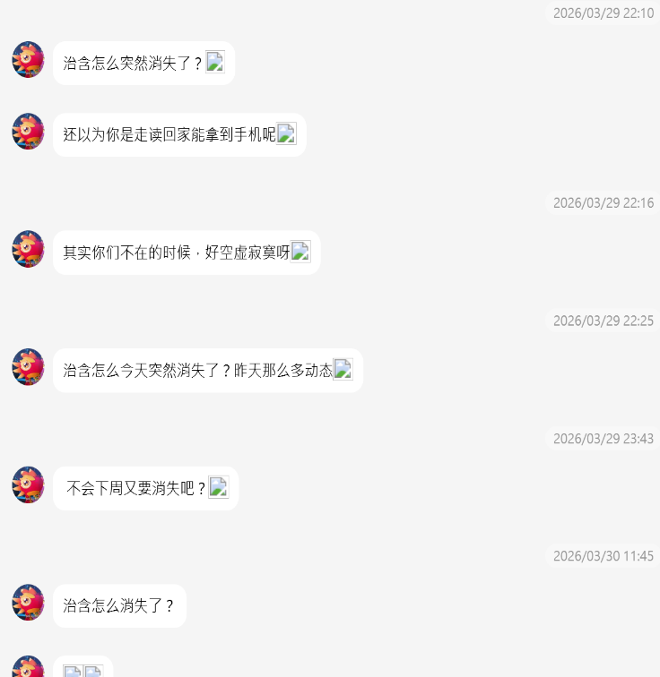

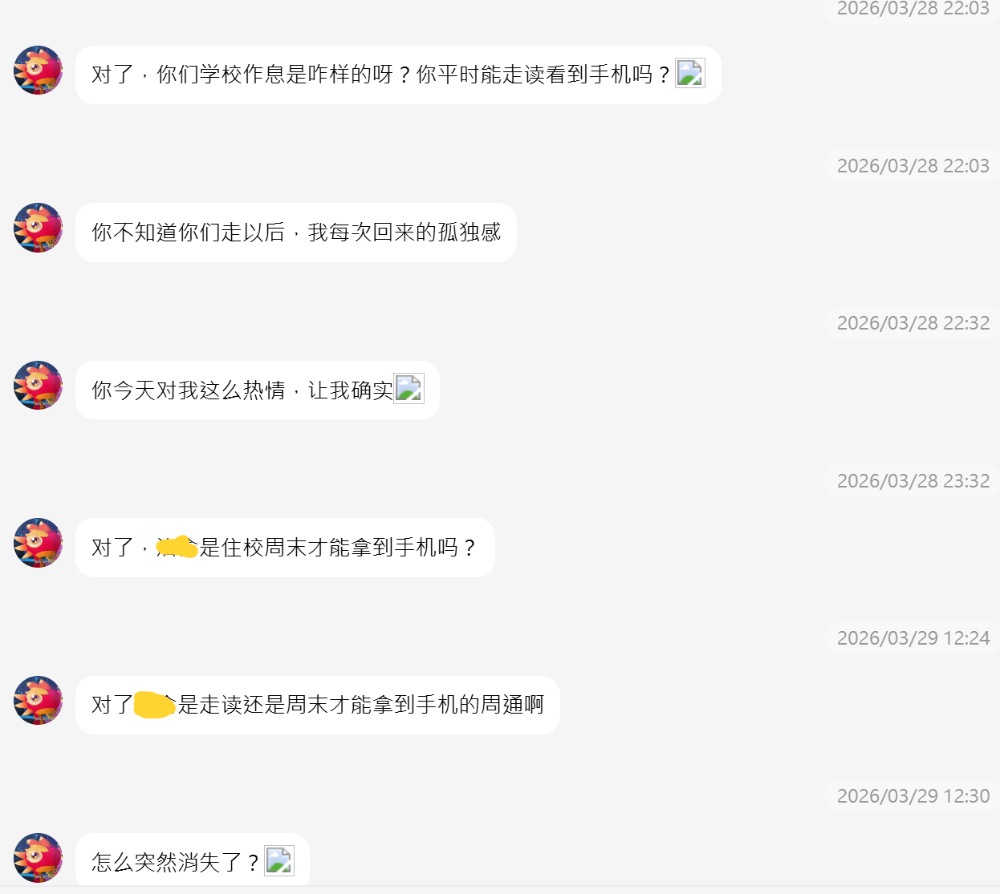

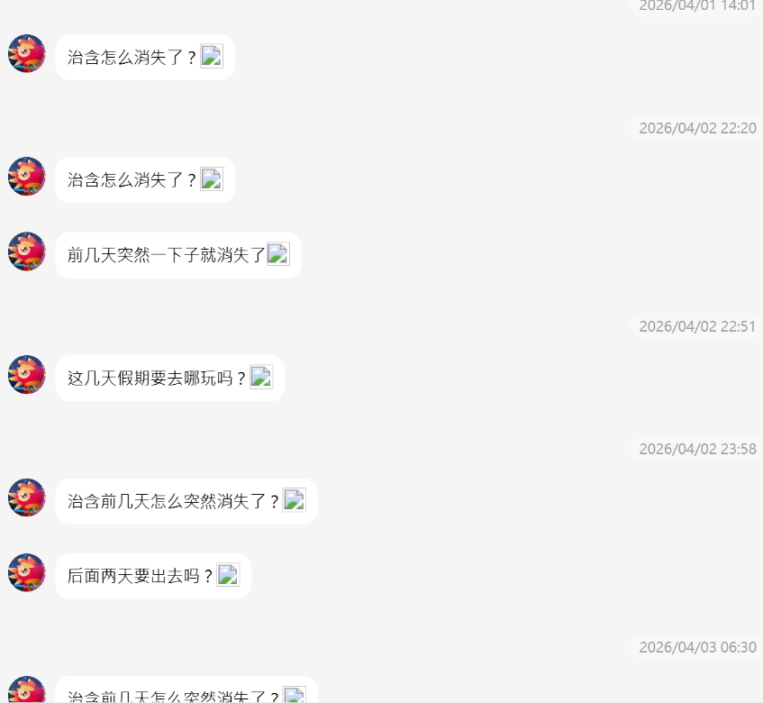

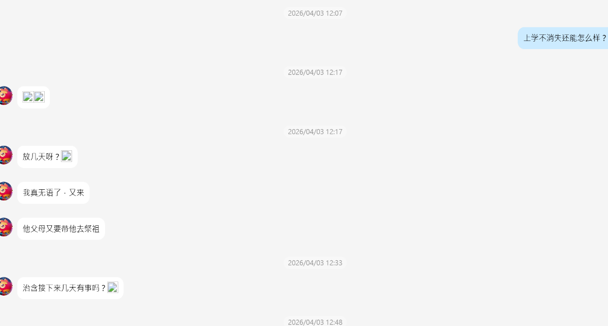

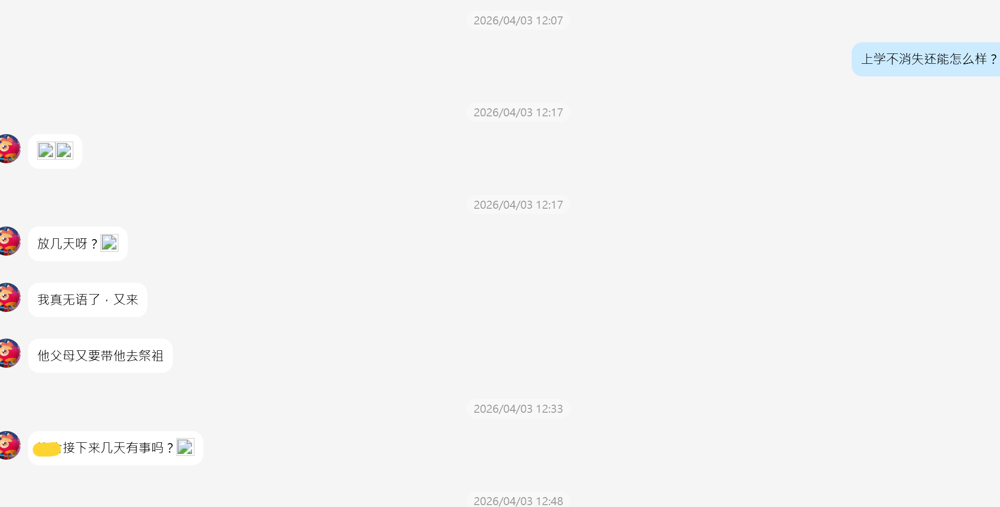

后来他又说要来见我。？？？我才跟他认识几天啊，就要来见面了？他还告诉我小晨的家长对小晨有"控制欲倾向"——我们常人理解的控制欲，肯定是压迫、不准出门、什么事都要依着……但后面解释完全不是这么回事！

我决定测试他，回复了一句"嗯嗯"，他居然真信了。从那之后，他发什么消息我都不理。

我去 QQ 空间才发现——他**每天都要来我的 QQ 空间看相册**！还是有人的那种！我有一种**被监视**的感觉，恶心极了，就立刻把空间锁住了。

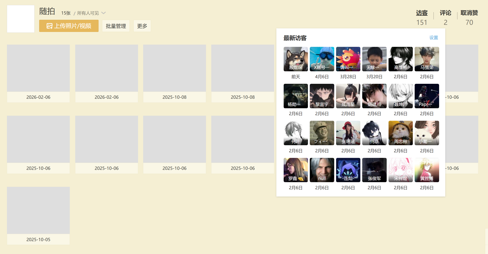

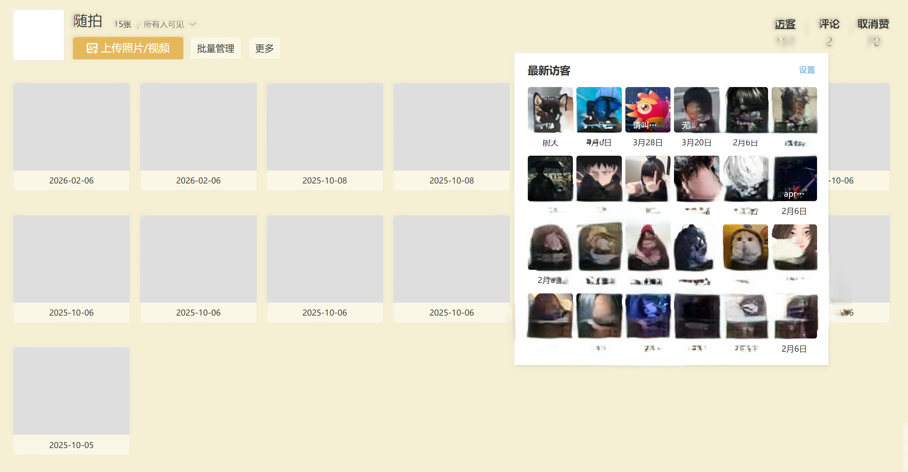

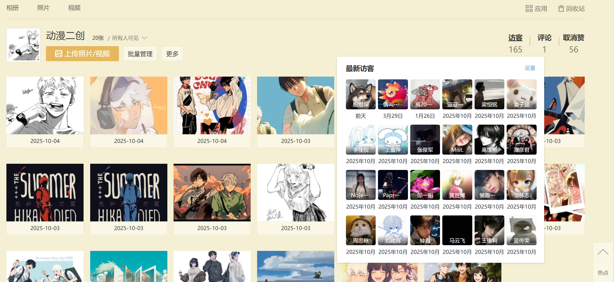

### 威胁

我一直以为我不理他，他也不会理我。**结果不是**。

4 月 4 日，他直接威胁我：

> "你要么把那个东西解除了好好聊，别在那装死，不然直接拉黑了。"
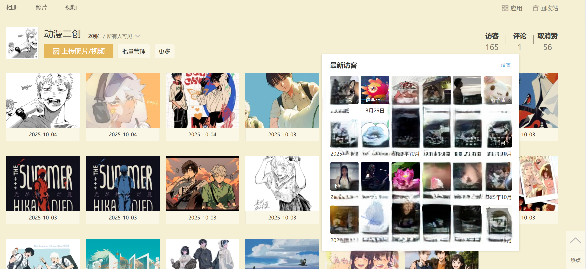

我被吓到了，二话不说就把他拉黑了。

然而……**第二天，他居然把他同学搬出来，要我跟他道歉！**

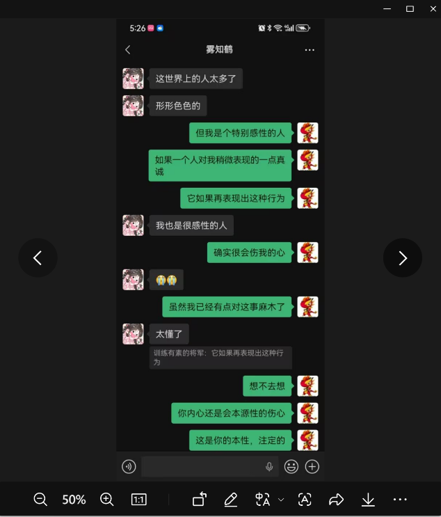

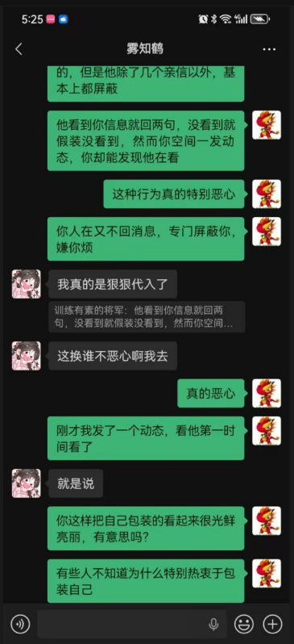

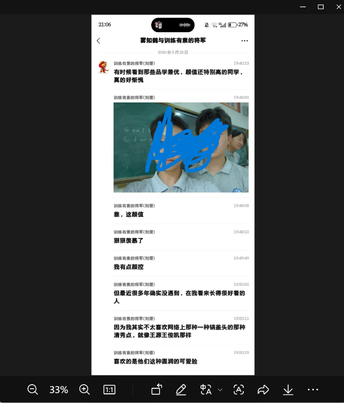

我真是无语透顶。他同学甚至只知道他 19 岁——可以说，他瞒住了所有人他的真实年龄。更可恶的是，他还乱发别人的照片！我当时快被气疯——**他凭什么拿我照片随便发？** 自己所做的一切，却只字不提！

### 小晨的经历

我的事暂告一段落，接着说小晨那边。

4 月 1 日至清明节，刘某一直问小晨出不出去玩。小晨用扫墓的事含糊过去了。你猜刘某跟我说什么？**"扫墓对任何人没有意义。"** 我只能说，他太有偏见了。

从那之后，他**每天**都问小晨在干什么。这哪像一个高三学生？明明知道小晨不想理他，他却一直在那里骚扰别人——别人也是要上学的啊！

后来小晨说他妈妈不让跟刘某玩。结果你猜怎么着？

刘某**直接坐高铁去成都**，跑到他妈妈的店铺里，"灌了两小时的迷魂汤"。妈妈回家后，指责了小晨。小晨彻底崩溃，把聊天记录甩给妈妈看——妈妈看完，什么也没说。

两天后，刘某又去找他妈妈，这次是直接指责他妈妈有"控制欲"。

而他理解的"控制欲"是什么？——当孩子出去玩时，家长问“**去哪里**”“**和谁去**”“**那个人品行怎么样**”。这难道不是家长应尽的义务吗？？？

还好，小晨在此之后跟刘某绝交了。可万万没想到——

### 持续骚扰

小晨删好友之后，刘某从各个渠道找来小晨的联系方式，说"还钱"——所谓的还水果钱、火锅钱的全额、还有之前**强制塞给小晨**的红包数百元（加起来总共还没 150 元）。

这简直不是人干的事。他还威胁说，不还钱就去小晨的学校造谣、告诉班主任，目标是**让他强基计划被取消**！

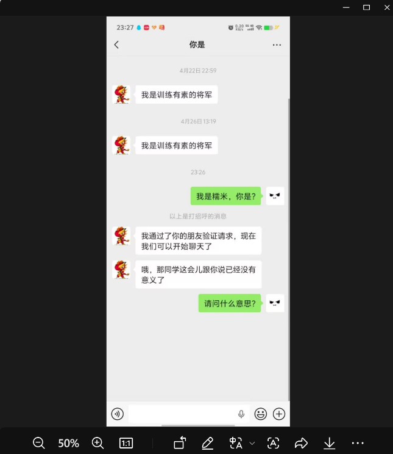

上周最让我崩溃的是——刘某不知道从哪里搞到了我朋友的微信，给他发了莫名其妙的话。细思极恐！

## 尾声

请你评评理，到底是谁有错？小晨已经准备好报案了。

写这篇文章的时候情绪很激动，行文可能有些凌乱，还请谅解。

---

**雷德**  
2026 年 5 月 23 日
